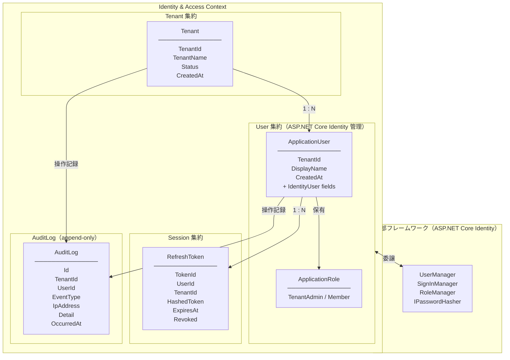

# ID管理・ログイン管理 設計提案

## 概要

マルチテナント業務アプリケーションにおける Identity & Access Management (IAM) の設計。
DDDアーキテクチャを採用し、テナント管理・ユーザー管理・認証を単一の境界コンテキストとして定義する。

**スコープ**: バックエンド API に特化。フロントエンドは別チームが担当するため本設計の対象外とする。
**技術スタック**: C# / ASP.NET Core MVC（Web API）/ ASP.NET Core Identity

### ASP.NET Core Identity の責務範囲

Identity フレームワークに委譲する機能と、ドメイン層で管理する機能を以下のように分離する。

| 機能 | 担当 |
|------|------|
| パスワードハッシュ化 | Identity（`IPasswordHasher<T>`） |
| ログイン失敗カウント・ロックアウト | Identity（`LockoutOptions` 設定） |
| パスワード強度バリデーション | Identity（`PasswordOptions` 設定） |
| ロール管理 | Identity（`RoleManager<IdentityRole>`） |
| ユーザーストア（CRUD） | Identity（`UserManager<T>`） |
| テナント管理 | ドメイン層（`Tenant` 集約） |
| JWT 発行・RefreshToken 管理 | アプリケーション層 ＋ インフラ層 |
| テナント境界の認可制御 | アプリケーション層 |

---

## 境界コンテキスト（Bounded Context）



---

## ドメインモデル設計

### Tenant 集約

| 要素 | 型 | 説明 |
|------|----|------|
| TenantId | UUID（値オブジェクト） | テナント識別子 |
| TenantName | 値オブジェクト（1〜100文字） | テナント名 |
| Status | `Active` / `Suspended` / `Deleted` | テナントステータス |
| CreatedAt | DateTime | 作成日時 |

**ドメインイベント**
- `TenantCreated`
- `TenantSuspended`

---

### User 集約

`ApplicationUser : IdentityUser<Guid>` として定義し、Identity の基底クラスを継承する。
パスワード・ロックアウト関連フィールドは Identity が管理するため、ドメイン拡張プロパティのみを定義する。

**ドメイン拡張プロパティ（ApplicationUser に追加）**

| 要素 | 型 | 説明 |
|------|----|------|
| TenantId | Guid | 所属テナント識別子 |
| DisplayName | string | 表示名 |
| CreatedAt | DateTime | 作成日時 |

**Identity が管理するプロパティ（継承元 IdentityUser）**

| 要素 | 説明 |
|------|------|
| Id（UserId） | ユーザー識別子（Guid） |
| Email / NormalizedEmail | メールアドレス |
| PasswordHash | パスワードHash |
| AccessFailedCount | ログイン失敗カウント |
| LockoutEnd | ロック解除日時 |
| LockoutEnabled | ロック機能有効フラグ |

**ロール定義**（`IdentityRole` で管理）
- `TenantAdmin`: テナント管理者
- `Member`: 一般メンバー

**ドメインイベント**
- `UserRegistered`
- `PasswordChanged`

> アカウントロックは Identity の `LockoutOptions`（`MaxFailedAccessAttempts`）で自動制御するため、`UserLocked` ドメインイベントは不要。

---

### RefreshToken 集約

| 要素 | 型 | 説明 |
|------|----|------|
| TokenId | UUID | トークン識別子 |
| UserId | 参照 | 対象ユーザー |
| TenantId | 参照 | 対象テナント |
| HashedToken | string | ハッシュ済みトークン値 |
| ExpiresAt | DateTime | 有効期限 |
| Revoked | boolean | 失効フラグ |

---

## ユースケース一覧

### テナント管理
| # | ユースケース | 実行者 |
|---|------------|--------|
| T-01 | テナント登録（初回管理者ユーザーも同時作成） | 未認証ユーザー |

### 認証
| # | ユースケース | 実行者 |
|---|------------|--------|
| A-01 | ログイン（Email + Password → JWT + RefreshToken） | 未認証ユーザー |
| A-02 | トークンリフレッシュ | 認証済みユーザー |
| A-03 | ログアウト（RefreshToken 失効） | 認証済みユーザー |

### ユーザー管理
| # | ユースケース | 実行者 |
|---|------------|--------|
| U-01 | ユーザー招待 | TenantAdmin |
| U-02 | パスワード変更 | 認証済みユーザー（本人） |
| U-03 | アカウントロック（ログイン失敗 N 回） | システム（自動） |

---

## レイヤー構成

```
src/
├── Domain/
│   ├── Tenant/
│   │   ├── Tenant.cs              # 集約ルート
│   │   ├── TenantId.cs            # 値オブジェクト
│   │   ├── TenantName.cs
│   │   ├── TenantStatus.cs
│   │   └── ITenantRepository.cs   # リポジトリインターフェース
│   ├── User/
│   │   ├── ApplicationUser.cs     # 集約ルート（IdentityUser<Guid> 継承）
│   │   └── ApplicationRole.cs     # ロール定義（IdentityRole<Guid> 継承）
│   │   # ※ Email・パスワード・ロックアウトは Identity 管理のため値オブジェクト不要
│   ├── Session/
│   │   ├── RefreshToken.cs
│   │   └── IRefreshTokenRepository.cs
│   ├── AuditLog/
│   │   ├── AuditLog.cs                # エンティティ（append-only）
│   │   └── IAuditLogRepository.cs     # インターフェース（DB差し替えの抽象化境界）
│   └── Shared/
│       └── DomainEvent.cs
│
├── Application/
│   ├── Tenant/
│   │   └── RegisterTenantUseCase.cs
│   ├── Auth/
│   │   ├── LoginUseCase.cs
│   │   ├── RefreshTokenUseCase.cs
│   │   └── LogoutUseCase.cs
│   └── User/
│       ├── InviteUserUseCase.cs
│       └── ChangePasswordUseCase.cs
│
├── Infrastructure/
│   ├── Persistence/
│   │   ├── AppDbContext.cs                 # DbContext（IdentityDbContext<ApplicationUser> 継承）
│   │   ├── TenantRepository.cs
│   │   ├── RefreshTokenRepository.cs       # UserRepository は UserManager<T> で代替
│   │   └── EfCoreAuditLogRepository.cs     # IAuditLogRepository の初期実装（同一DB）
│   └── Auth/
│       ├── JwtService.cs
│       └── IdentityConfiguration.cs        # LockoutOptions / PasswordOptions 設定
│
└── WebApi/                        # ASP.NET Core MVC（フロントエンド連携はAPI経由）
    ├── Controllers/
    │   ├── TenantController.cs
    │   ├── AuthController.cs
    │   └── UserController.cs
    └── Dtos/
        ├── LoginRequest.cs
        ├── LoginResponse.cs
        └── RegisterTenantRequest.cs
```

---

## ログインフロー（ドメインロジックの責務分担）

```
LoginUseCase
  │
  ├─ UserManager<ApplicationUser>.FindByEmailAsync(email)
  │     → null の場合 → 認証失敗（情報漏洩防止で同一エラーを返す）
  │
  ├─ テナント整合性チェック（user.TenantId == requestTenantId）
  │     → 不一致の場合 → 認証失敗
  │
  ├─ SignInManager.CheckPasswordSignInAsync(user, password, lockoutOnFailure: true)
  │     → 失敗カウント・ロックアウトは Identity が自動管理
  │     → SignInResult.IsLockedOut / Succeeded で結果を判定
  │
  ├─ UserManager.GetRolesAsync(user)
  │
  ├─ JwtService.Issue(userId, tenantId, roles)
  │     → AccessToken（短命）を発行
  │
  └─ RefreshToken.Create(userId, tenantId, expiresAt)
        → IRefreshTokenRepository.Save()
```

---

## 監査ログ設計

### 方針

初期実装は **同一DB・専用テーブル（A案）** で構築する。
将来の **別DB移行（B案）** に備え、`IAuditLogRepository` インターフェースで実装を抽象化し、
DI の差し替えのみで移行できる構造とする。

```
Application 層
  └─ IAuditLogRepository（インターフェース）  ← ここには変更不要
        │
        ├─ [現在] EfCoreAuditLogRepository   # 同一DB に EF Core で書き込み
        └─ [将来] ExternalDbAuditLogRepository # 別DB への書き込みに差し替え
```

### 記録対象イベント

| カテゴリ | イベント種別 |
|---------|------------|
| 認証 | `auth.login.success` / `auth.login.failed` / `auth.lockout` / `auth.logout` / `auth.token.refresh` |
| ユーザー管理 | `user.created` / `user.invited` / `user.password.changed` / `user.role.changed` |
| テナント管理 | `tenant.created` / `tenant.suspended` |

### AuditLog テーブル設計

| カラム | 型 | 説明 |
|-------|----|------|
| Id | Guid（PK） | ログ識別子 |
| TenantId | Guid | テナント識別子（テナント横断クエリ用） |
| UserId | Guid? | 操作ユーザー（未認証時は null） |
| EventType | string | イベント種別（例: `auth.login.success`） |
| IpAddress | string | クライアントIP |
| UserAgent | string | クライアント情報 |
| Detail | JSON | イベント固有の追加情報 |
| OccurredAt | DateTime（UTC） | 発生日時 |

> - INSERT のみ許可（UPDATE / DELETE 禁止）
> - `OccurredAt` にインデックスを付与（テナント別・期間別クエリの高速化）

### 記録タイミング（アプリケーション層での責務）

```
LoginUseCase
  │
  ├─ 認証成功 → IAuditLogRepository.AppendAsync(LoginSucceeded)
  ├─ 認証失敗 → IAuditLogRepository.AppendAsync(LoginFailed)
  └─ ロックアウト → IAuditLogRepository.AppendAsync(AccountLockedOut)

InviteUserUseCase
  └─ ユーザー作成後 → IAuditLogRepository.AppendAsync(UserInvited)

ChangePasswordUseCase
  └─ 変更成功後 → IAuditLogRepository.AppendAsync(PasswordChanged)
```

### 将来の別DB移行手順（参考）

1. `ExternalDbAuditLogRepository` を `Infrastructure/AuditLog/` に追加実装
2. DI 登録を `EfCoreAuditLogRepository` から差し替え
3. アプリケーション層・ドメイン層への変更は不要

---

## 未決定事項

| 項目 | 内容 | ステータス |
|------|------|----------|
| 言語・フレームワーク | C# / ASP.NET Core MVC（Web API） | **確定** |
| 認証ライブラリ | ASP.NET Core Identity | **確定** |
| フロントエンド | 別チーム担当・本設計の対象外 | **確定** |
| 監査ログ保存方式 | A案（同一DB・専用テーブル）で初期実装。`IAuditLogRepository` で抽象化し将来B案（別DB）へ移行可能 | **確定** |
| DB | PostgreSQL 推奨（スキーマ分離対応可能） | 未確定 |
| JWT方式 | 短命AccessToken + RefreshTokenローテーション推奨 | 未確定 |
| マルチテナント分離方式 | 未定（シングルDB / スキーマ分離 / DB分離） | 未確定 |
| ログイン失敗ロック閾値 | Identity の `MaxFailedAccessAttempts` で設定（例：5回） | 未確定 |
