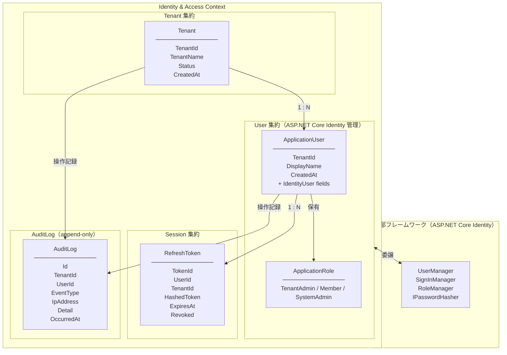

# ID管理・ログイン管理 設計提案

## 概要

マルチテナント業務アプリケーションにおける Identity & Access Management (IAM) の設計。
DDDアーキテクチャを採用し、テナント管理・ユーザー管理・認証を単一の境界コンテキストとして定義する。

**スコープ**: バックエンド API に特化。フロントエンドは別チームが担当するため本設計の対象外とする。
**技術スタック**: C# / ASP.NET Core MVC（Web API）/ ASP.NET Core Identity

### 設計上のトレードオフ（意図的な決定）

| 項目 | 決定内容 | 理由 |
|------|---------|------|
| User集約のIdentity依存 | `ApplicationUser : IdentityUser<Guid>` をドメイン層に配置 | ASP.NET Core Identityとの統合コストを優先。純粋DDD原則より実用性を選択 |
| Session集約の独立 | RefreshTokenをUser集約から分離した独立集約として管理 | ユーザーロード時のN+1回避、スケーラビリティ確保のため |

### ASP.NET Core Identity の責務範囲

Identity フレームワークに委譲する機能と、ドメイン層で管理する機能を以下のように分離する。

| 機能 | 担当 |
|------|------|
| パスワードハッシュ化 | Identity（`IPasswordHasher<T>`） |
| ログイン失敗カウント・ロックアウト | Identity（`LockoutOptions` 設定） |
| パスワード強度バリデーション | Identity（`PasswordOptions` 設定） |
| ロール管理 | Identity（`RoleManager<IdentityRole>`） |
| ユーザーストア（CRUD） | Identity（`UserManager<T>`） |
| パスワードリセットトークン生成・検証 | Identity（`GeneratePasswordResetTokenAsync`） |
| テナント管理 | ドメイン層（`Tenant` 集約） |
| JWT 発行・RefreshToken 管理 | アプリケーション層 ＋ インフラ層 |
| テナント境界の認可制御 | アプリケーション層 |

---

## 境界コンテキスト（Bounded Context）



---

## ドメインモデル設計

### Tenant 集約

| 要素 | 型 | 説明 |
|------|----|------|
| TenantId | UUID（値オブジェクト） | テナント識別子 |
| TenantName | 値オブジェクト（1〜100文字） | テナント名 |
| Status | `Active` / `Suspended` / `Deleted` | テナントステータス |
| CreatedAt | DateTime | 作成日時 |

**ドメインイベント**
- `TenantCreated`
- `TenantSuspended`

---

### User 集約

`ApplicationUser : IdentityUser<Guid>` として定義し、Identity の基底クラスを継承する。
パスワード・ロックアウト関連フィールドは Identity が管理するため、ドメイン拡張プロパティのみを定義する。

**ドメイン拡張プロパティ（ApplicationUser に追加）**

| 要素 | 型 | 説明 |
|------|----|------|
| TenantId | Guid | 所属テナント識別子 |
| DisplayName | string | 表示名 |
| ContactEmail | string（必須） | 連絡用メールアドレス。Gmail 等の外部メールアドレスを登録。ログイン用 Email とは独立して管理 |
| CreatedAt | DateTime | 作成日時 |

> `ContactEmail` はユーザー登録時に必須入力。パスワードリセットメールや通知の送信先として使用する。
> ログイン用 `Email`（Identity 管理）とは別フィールドとして扱い、変更時は本人確認を要求する。

**Identity が管理するプロパティ（継承元 IdentityUser）**

| 要素 | 説明 |
|------|------|
| Id（UserId） | ユーザー識別子（Guid）。**システムが自動採番**（`Guid.NewGuid()`）し、クライアントからの指定は不可 |
| Email / NormalizedEmail | メールアドレス |
| PasswordHash | パスワードHash |
| AccessFailedCount | ログイン失敗カウント |
| LockoutEnd | ロック解除日時 |
| LockoutEnabled | ロック機能有効フラグ |

**ロール定義**（`IdentityRole` で管理）
- `SystemAdmin`: システム管理者（テナント停止・削除など全テナント横断操作）
- `TenantAdmin`: テナント管理者
- `Member`: 一般メンバー

**ドメインイベント**
- `UserRegistered`
- `PasswordChanged`

> アカウントロックは Identity の `LockoutOptions`（`MaxFailedAccessAttempts`）で自動制御するため、`UserLocked` ドメインイベントは不要。

---

### Session 集約

> **命名統一**: 境界コンテキスト図・ドメインモデル・レイヤー構成すべて「Session 集約」に統一する。

| 要素 | 型 | 説明 |
|------|----|------|
| TokenId | UUID | トークン識別子 |
| UserId | 参照 | 対象ユーザー |
| TenantId | 参照 | 対象テナント |
| HashedToken | string | ハッシュ済みトークン値 |
| ExpiresAt | DateTime | 有効期限 |
| Revoked | boolean | 失効フラグ |

---

## ユースケース一覧

### テナント管理
| # | ユースケース | 実行者 | 優先度 |
|---|------------|--------|--------|
| T-01 | テナント登録（初回管理者ユーザーも同時作成） | 未認証ユーザー | 高 |
| T-02 | テナント情報更新 | TenantAdmin | 中 |
| T-03 | テナント停止 | SystemAdmin | 低 |
| T-04 | テナント削除（論理削除） | SystemAdmin | 低 |
| T-05 | テナントデータ使用量取得 | TenantAdmin / SystemAdmin | 中 |

### 認証
| # | ユースケース | 実行者 | 優先度 |
|---|------------|--------|--------|
| A-01 | ログイン（Email + Password → JWT + RefreshToken） | 未認証ユーザー | 高 |
| A-02 | トークンリフレッシュ | 認証済みユーザー | 高 |
| A-03 | ログアウト（RefreshToken 失効） | 認証済みユーザー | 高 |
| A-04 | パスワードリセット要求（メール送信） | 未認証ユーザー | 高 |
| A-05 | パスワードリセット実行（トークン検証） | 未認証ユーザー | 高 |
| A-06 | メールアドレス検証（招待リンク） | 未認証ユーザー | 中 |
| A-07 | 全デバイスログアウト（全RefreshToken失効） | 認証済みユーザー | 中 |

### ユーザー管理
| # | ユースケース | 実行者 | 優先度 |
|---|------------|--------|--------|
| U-01 | ユーザー招待 | TenantAdmin | 高 |
| U-02 | パスワード変更 | 認証済みユーザー（本人） | 高 |
| U-03 | アカウントロック（ログイン失敗 N 回） | システム（自動） | 高 |
| U-04 | ユーザー一覧取得（テナント内） | TenantAdmin | 高 |
| U-05 | ユーザー削除（論理削除） | TenantAdmin | 中 |
| U-06 | ロール変更 | TenantAdmin | 中 |
| U-07 | アカウントロック解除 | TenantAdmin | 低 |

---

## テナント登録トランザクション戦略

T-01「テナント登録（初回管理者ユーザーも同時作成）」は Tenant 集約と User 集約を同時作成するため、整合性戦略を明確にする。

**初期実装: 単一トランザクション（C案）**

```csharp
// Application層 - RegisterTenantUseCase
public async Task<Result> RegisterTenantAsync(RegisterTenantRequest request)
{
    using var transaction = await _dbContext.BeginTransactionAsync();
    try
    {
        // 1. Tenant作成
        var tenant = Tenant.Create(request.TenantName);
        await _tenantRepository.SaveAsync(tenant);

        // 2. 初回管理者User作成
        var appUser = new ApplicationUser
        {
            TenantId = tenant.Id,
            DisplayName = request.AdminDisplayName,
            Email = request.AdminEmail,
            UserName = request.AdminEmail
        };
        await _userManager.CreateAsync(appUser, request.AdminPassword);
        await _userManager.AddToRoleAsync(appUser, "TenantAdmin");

        await transaction.CommitAsync();
        return Result.Success();
    }
    catch
    {
        await transaction.RollbackAsync();
        return Result.Failure("テナント登録に失敗しました");
    }
}
```

> **方針**: 初期実装は単一トランザクションで整合性を保証する。
> 将来的にマイクロサービス分割が必要になった場合は、`TenantCreated` ドメインイベント + イベントハンドラによる結果整合性（Saga パターン）への移行を検討する。

---

## レイヤー構成

```
src/
├── Domain/
│   ├── Tenant/
│   │   ├── Tenant.cs              # 集約ルート
│   │   ├── TenantId.cs            # 値オブジェクト
│   │   ├── TenantName.cs
│   │   ├── TenantStatus.cs
│   │   └── ITenantRepository.cs   # リポジトリインターフェース
│   ├── User/
│   │   ├── ApplicationUser.cs     # 集約ルート（IdentityUser<Guid> 継承）
│   │   └── ApplicationRole.cs     # ロール定義（IdentityRole<Guid> 継承）
│   │   # ※ Email・パスワード・ロックアウトは Identity 管理のため値オブジェクト不要
│   ├── Session/                   # Session 集約（RefreshToken管理）
│   │   ├── RefreshToken.cs
│   │   └── IRefreshTokenRepository.cs
│   ├── AuditLog/
│   │   ├── AuditLog.cs                # エンティティ（append-only）
│   │   └── IAuditLogRepository.cs     # インターフェース（DB差し替えの抽象化境界）
│   └── Shared/
│       └── DomainEvent.cs
│
├── Application/
│   ├── Tenant/
│   │   ├── RegisterTenantUseCase.cs
│   │   ├── UpdateTenantUseCase.cs           # T-02
│   │   ├── SuspendTenantUseCase.cs          # T-03
│   │   ├── DeleteTenantUseCase.cs           # T-04
│   │   └── GetTenantUsageUseCase.cs         # T-05
│   ├── Auth/
│   │   ├── LoginUseCase.cs
│   │   ├── RefreshTokenUseCase.cs
│   │   ├── LogoutUseCase.cs
│   │   ├── PasswordResetRequestUseCase.cs   # A-04
│   │   ├── PasswordResetExecuteUseCase.cs   # A-05
│   │   ├── VerifyEmailUseCase.cs            # A-06
│   │   └── LogoutAllDevicesUseCase.cs       # A-07
│   └── User/
│       ├── InviteUserUseCase.cs
│       ├── ChangePasswordUseCase.cs
│       ├── ListUsersUseCase.cs              # U-04
│       ├── DeleteUserUseCase.cs             # U-05
│       ├── ChangeUserRoleUseCase.cs         # U-06
│       └── UnlockUserUseCase.cs            # U-07
│
├── Infrastructure/
│   ├── Persistence/
│   │   ├── AppDbContext.cs                 # DbContext（IdentityDbContext<ApplicationUser> 継承）
│   │   ├── TenantRepository.cs
│   │   ├── RefreshTokenRepository.cs       # UserRepository は UserManager<T> で代替
│   │   └── EfCoreAuditLogRepository.cs     # IAuditLogRepository の初期実装（同一DB）
│   └── Auth/
│       ├── JwtService.cs
│       ├── PasswordResetEmailService.cs    # A-04/A-05 メール送信
│       └── IdentityConfiguration.cs        # LockoutOptions / PasswordOptions 設定
│
└── WebApi/                        # ASP.NET Core MVC（フロントエンド連携はAPI経由）
    ├── Controllers/
    │   ├── TenantController.cs
    │   ├── AuthController.cs
    │   └── UserController.cs
    └── Dtos/
        ├── LoginRequest.cs
        ├── LoginResponse.cs
        └── RegisterTenantRequest.cs
```

---

## ログインフロー（ドメインロジックの責務分担）

> **セキュリティ方針**: すべての失敗ケースで同一エラーメッセージ「メールアドレスまたはパスワードが正しくありません」を返す。
> テナント整合性チェックをパスワード検証より**後**に実施することで、「このメールアドレスは別テナントに存在する」という情報漏洩を防止する。

```
LoginUseCase
  │
  ├─ [レート制限チェック] IP単位・メールアドレス単位の過剰リクエスト検出
  │
  ├─ UserManager<ApplicationUser>.FindByEmailAsync(email)
  │
  ├─ user が null の場合
  │     → _passwordHasher.VerifyHashedPassword("", password)  // タイミング均一化（NullReferenceException防止）
  │     → 認証失敗（同一エラー）
  │
  ├─ user が存在する場合
  │     → SignInManager.CheckPasswordSignInAsync(user, password, lockoutOnFailure: true)
  │     → 失敗カウント・ロックアウトは Identity が自動管理
  │     → SignInResult.IsLockedOut / Succeeded で結果を判定
  │     → 失敗の場合 → 認証失敗（同一エラー）
  │
  ├─ テナント整合性チェック（user.TenantId == requestTenantId）
  │     → 不一致の場合 → 認証失敗（同一エラー）
  │     ※ パスワード検証後に実施することで情報漏洩を防止
  │
  ├─ UserManager.GetRolesAsync(user)
  │
  ├─ JwtService.Issue(userId, tenantId, roles)
  │     → AccessToken（短命）を発行
  │
  └─ RefreshToken.Create(userId, tenantId, expiresAt)
        → IRefreshTokenRepository.Save()
```

---

## 監査ログ設計

### 方針

初期実装は **同一DB・専用テーブル（A案）** で構築する。
将来の **別DB移行（B案）** に備え、`IAuditLogRepository` インターフェースで実装を抽象化し、
DI の差し替えのみで移行できる構造とする。

```
Application 層
  └─ IAuditLogRepository（インターフェース）  ← ここには変更不要
        │
        ├─ [現在] EfCoreAuditLogRepository   # 同一DB に EF Core で書き込み
        └─ [将来] ExternalDbAuditLogRepository # 別DB への書き込みに差し替え
```

### 記録対象イベント

| カテゴリ | イベント種別 |
|---------|------------|
| 認証 | `auth.login.success` / `auth.login.failed` / `auth.lockout` / `auth.logout` / `auth.token.refresh` / `auth.logout.all_devices` / `auth.password.reset.request` / `auth.password.reset.complete` |
| ユーザー管理 | `user.created` / `user.invited` / `user.password.changed` / `user.role.changed` / `user.deleted` |
| テナント管理 | `tenant.created` / `tenant.suspended` / `tenant.deleted` |

### AuditLog テーブル設計

| カラム | 型 | 説明 |
|-------|----|------|
| Id | Guid（PK） | ログ識別子 |
| TenantId | Guid | テナント識別子（テナント横断クエリ用） |
| UserId | Guid? | 操作ユーザー（未認証時は null） |
| EventType | string | イベント種別（例: `auth.login.success`） |
| IpAddress | string | クライアントIP |
| UserAgent | string | クライアント情報 |
| Detail | JSON | イベント固有の追加情報 |
| OccurredAt | DateTime（UTC） | 発生日時 |

> - INSERT のみ許可（UPDATE / DELETE 禁止）
> - `OccurredAt` にインデックスを付与（テナント別・期間別クエリの高速化）

### 記録タイミング（アプリケーション層での責務）

```
LoginUseCase
  ├─ 認証成功 → IAuditLogRepository.AppendAsync(auth.login.success)
  ├─ 認証失敗 → IAuditLogRepository.AppendAsync(auth.login.failed)
  └─ ロックアウト → IAuditLogRepository.AppendAsync(auth.lockout)

LogoutUseCase
  └─ ログアウト → IAuditLogRepository.AppendAsync(auth.logout)

LogoutAllDevicesUseCase
  └─ 全デバイスログアウト → IAuditLogRepository.AppendAsync(auth.logout.all_devices)

PasswordResetRequestUseCase
  └─ リセット要求 → IAuditLogRepository.AppendAsync(auth.password.reset.request)

PasswordResetExecuteUseCase
  └─ リセット完了 → IAuditLogRepository.AppendAsync(auth.password.reset.complete)

InviteUserUseCase
  └─ ユーザー作成後 → IAuditLogRepository.AppendAsync(user.invited)

ChangePasswordUseCase
  └─ 変更成功後 → IAuditLogRepository.AppendAsync(user.password.changed)

DeleteUserUseCase
  └─ 削除後 → IAuditLogRepository.AppendAsync(user.deleted)

ChangeUserRoleUseCase
  └─ ロール変更後 → IAuditLogRepository.AppendAsync(user.role.changed)

SuspendTenantUseCase
  └─ 停止後 → IAuditLogRepository.AppendAsync(tenant.suspended)

DeleteTenantUseCase
  └─ 削除後 → IAuditLogRepository.AppendAsync(tenant.deleted)
```

### 推奨インデックス

```sql
-- Tenant
CREATE INDEX idx_tenant_status ON Tenant(Status);

-- ApplicationUser
CREATE INDEX idx_user_tenant ON ApplicationUser(TenantId);
CREATE INDEX idx_user_email  ON ApplicationUser(NormalizedEmail);

-- RefreshToken（Session集約）
CREATE UNIQUE INDEX idx_refreshtoken_hashed  ON RefreshToken(HashedToken);
CREATE INDEX        idx_refreshtoken_user    ON RefreshToken(UserId);
CREATE INDEX        idx_refreshtoken_expiry  ON RefreshToken(ExpiresAt) WHERE Revoked = false;

-- AuditLog
CREATE INDEX idx_auditlog_tenant_time ON AuditLog(TenantId, OccurredAt DESC);
CREATE INDEX idx_auditlog_user        ON AuditLog(UserId);
CREATE INDEX idx_auditlog_eventtype   ON AuditLog(EventType);
```

### 将来の別DB移行手順（参考）

1. `ExternalDbAuditLogRepository` を `Infrastructure/AuditLog/` に追加実装
2. DI 登録を `EfCoreAuditLogRepository` から差し替え
3. アプリケーション層・ドメイン層への変更は不要

---

## セキュリティ考慮事項

### JWT 保存場所
| 方式 | リスク | 採用方針 |
|------|--------|----------|
| LocalStorage | XSS で盗取可能 | **非推奨** |
| HttpOnly Cookie | XSS 耐性あり（CSRF 対策別途要） | **推奨** |

> AccessToken は HttpOnly Cookie に保存し、`SameSite=Strict` を設定する。
> RefreshToken も同様に HttpOnly Cookie で管理し、LocalStorage への保存は禁止する。

### レート制限
| エンドポイント | 制限 | ブロック方針 |
|--------------|------|------------|
| POST /auth/login | 5回/分（IPアドレス単位） | 429 Too Many Requests |
| POST /auth/login | 10回/時（メールアドレス単位） | 429 Too Many Requests |
| POST /auth/token/refresh | 10回/分（ユーザー単位） | 429 Too Many Requests |

### パスワードリセットフロー（A-04 / A-05）

パスワードリセットトークンは ASP.NET Core Identity の `GeneratePasswordResetTokenAsync` に委譲する。
追加のドメインモデルは不要。メール送信インフラとして `Infrastructure/Auth/PasswordResetEmailService.cs` を追加する。

```
A-04: パスワードリセット要求
  └─ UserManager.FindByEmailAsync(email)
        → 存在しても/しなくても同一レスポンス（情報漏洩防止）
        → 存在する場合のみ:
            UserManager.GeneratePasswordResetTokenAsync(user)  // Identity に委譲
            PasswordResetEmailService.SendAsync(email, token)  // メール送信（有効期限: 1時間）

A-05: パスワードリセット実行
  └─ UserManager.FindByEmailAsync(email)
        → UserManager.ResetPasswordAsync(user, token, newPassword)  // Identity がトークン検証
        → IRefreshTokenRepository.RevokeAllByUserId(userId)  // 全RefreshToken失効（セキュリティ）
```

### CSRF 対策
RefreshToken Cookie 使用時は `SameSite=Strict` で CSRF を防止する。
さらに重要操作（パスワード変更、全ログアウト）には再認証を要求する。

### ログイン失敗ロックアウト
```csharp
// Infrastructure/Auth/IdentityConfiguration.cs
options.Lockout.MaxFailedAccessAttempts = 5;   // 5回失敗でロック
options.Lockout.DefaultLockoutTimeSpan = TimeSpan.FromMinutes(30);
options.Lockout.AllowedForNewUsers = true;
```

---

## テナントデータ使用量設計

### 集計対象

| 項目 | 集計方法 |
|------|---------|
| ユーザー数 | `ApplicationUser` テーブルの `TenantId` 別カウント（論理削除済みを除く） |
| 監査ログ件数 | `AuditLog` テーブルの `TenantId` 別カウント |
| 監査ログサイズ（概算） | 件数 × 平均レコードサイズで推計 |

### API レスポンス例

```json
GET /tenants/{tenantId}/usage

{
  "tenantId": "...",
  "userCount": 42,
  "auditLogCount": 15320,
  "auditLogSizeBytes": 4596000,
  "measuredAt": "2026-04-02T00:00:00Z"
}
```

### 認可
- `TenantAdmin`: 自テナントの使用量のみ参照可
- `SystemAdmin`: 全テナントの使用量を参照可

---

## 運用考慮事項

| # | 項目 | 方針 |
|---|------|------|
| O-01 | **RefreshToken クリーンアップ** | 期限切れ・失効済みトークンを日次バッチで削除 |
| O-02 | **監査ログ保持期間** | 1年間保持。期間超過分は定期アーカイブまたは削除 |
| O-03 | **テナント削除** | 論理削除（`Status=Deleted`）のみ。物理削除は別途データ保持ポリシーで決定 |
| O-04 | **同時ログインデバイス制限** | 初期は制限なし（RefreshToken の数で自然に制限）。必要に応じて上限設定を追加 |

---

## パフォーマンス考慮事項

| # | 項目 | 対策 |
|---|------|------|
| P-01 | User 取得時の Role ロード | Eager Loading: `.Include(u => u.UserRoles).ThenInclude(ur => ur.Role)`（Identity の many-to-many 構造に対応） |
| P-02 | 監査ログ書き込みの遅延 | 非同期処理（`fire-and-forget` or バックグラウンドキュー）で本処理をブロックしない |
| P-03 | RefreshToken の検索 | `HashedToken` カラムに一意インデックスを付与 |
| P-04 | 監査ログの範囲クエリ | `(TenantId, OccurredAt)` 複合インデックスを付与 |

---

## 未決定事項

| 項目 | 内容 | ステータス |
|------|------|----------|
| 言語・フレームワーク | C# / ASP.NET Core MVC（Web API） | **確定** |
| 認証ライブラリ | ASP.NET Core Identity | **確定** |
| フロントエンド | 別チーム担当・本設計の対象外 | **確定** |
| 監査ログ保存方式 | A案（同一DB・専用テーブル）で初期実装。`IAuditLogRepository` で抽象化し将来B案（別DB）へ移行可能 | **確定** |
| ログイン失敗ロック閾値 | 5回失敗で30分ロック（`MaxFailedAccessAttempts=5`, `DefaultLockoutTimeSpan=30min`） | **確定** |
| DB | PostgreSQL 推奨 | 未確定 |
| JWT方式 | 短命AccessToken（15分推奨）+ RefreshTokenローテーション（7日推奨） | 未確定 |
| マルチテナント分離方式 | シングルDB（TenantId による行レベル分離） | **確定** |
| SystemAdmin 認証方式 | `SystemAdmin` ロール or APIキー認証 | 未確定 |
